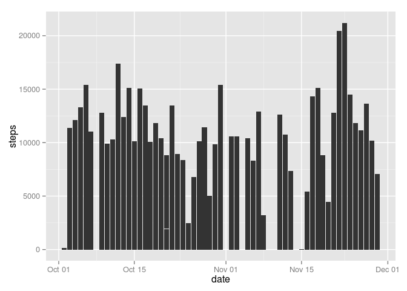

# Reproducible Research: Peer Assessment 1


## Loading and preprocessing the data

### Loading

Let's check if we have a "data" folder in our analysis template. Then we'll upload and unzip the data there.


```r
# Does this directory exist. If not, I'll do all the work for you.
if(!file.exists("./data")) { dir.create("./data") }

# The zip file.
fileURL <- "https://d396qusza40orc.cloudfront.net/repdata%2Fdata%2Factivity.zip"

# Downloading the zip and placing it in the data folder.
download.file(fileURL,"./data/repdata-data-activity.zip", method="curl")

# Unzip and TADA!
unzip("./data/repdata-data-activity.zip", exdir="data")

# Let's get rid of that ugly zip file because I like to keep things clean.
file.remove("./data/repdata-data-activity.zip")
```

```
## [1] TRUE
```

```r
# Last stop: data-ville
data <- read.csv("./data/activity.csv")
```

### Preprocessing

Let's take a peek under the data's hood and see what we're dealing with.


```r
str(data)
```

```
## 'data.frame':	17568 obs. of  3 variables:
##  $ steps   : int  NA NA NA NA NA NA NA NA NA NA ...
##  $ date    : Factor w/ 61 levels "2012-10-01","2012-10-02",..: 1 1 1 1 1 1 1 1 1 1 ...
##  $ interval: int  0 5 10 15 20 25 30 35 40 45 ...
```

That "date" variable should be in the Date class to make life easier for everyone. I prefer dplyr's mutate function because it makes me feel like I'm creating a new X-men character who has the power to report dates accurately.


```r
library(dplyr)

data <- data %>% mutate(date = as.Date(date))
```


## What is mean total number of steps taken per day?

Let's create a plot of the overall steps taken per day and then find our mean and median.


```r
library(ggplot2)

ggplot(data = data) + geom_bar(aes(date, steps), stat="identity")
```

 

## What is the average daily activity pattern?


## Imputing missing values


## Are there differences in activity patterns between weekdays and weekends?
