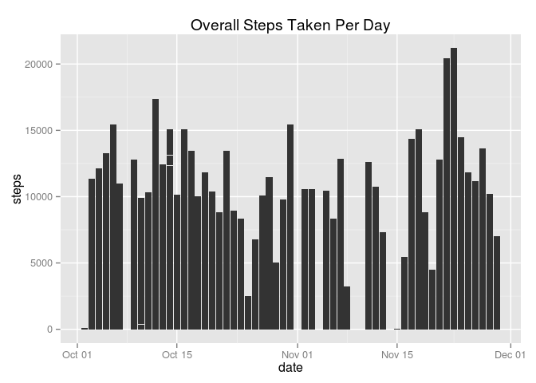
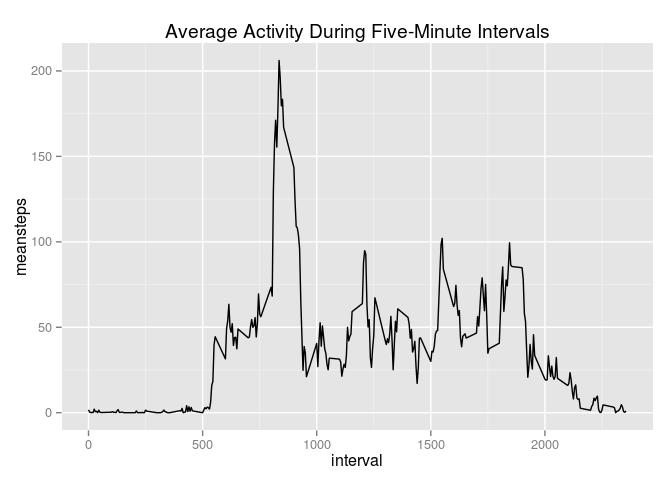
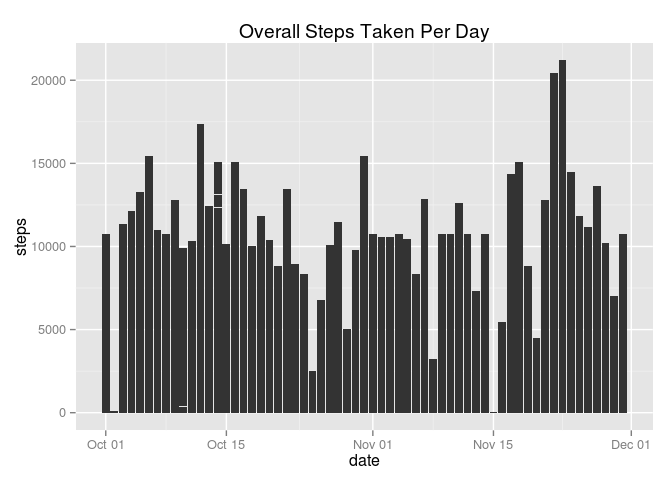
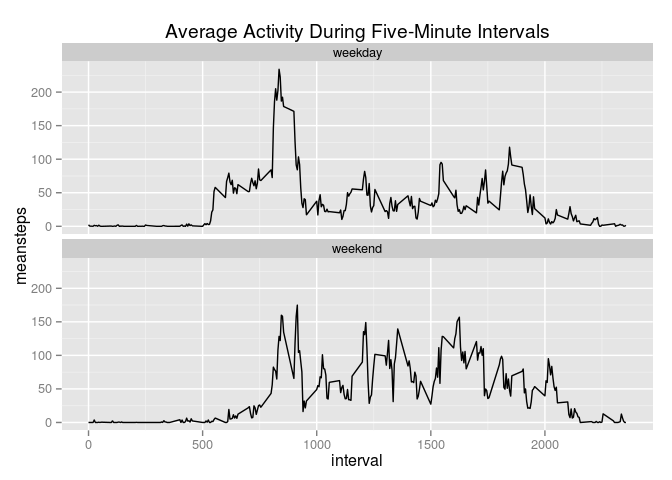

# Reproducible Research: Peer Assessment 1
By Matthew Sedlar  

## Overview

This report looks at data from a personal activity monitoring device and contains an exploratory analysis of the data. The device collected data at 5-minute intervals through out the day. The data consists of two months of data from an anonymous individual collected during the months of October and November, 2012, and include the number of steps taken in 5-minute intervals each day.

## Loading and preprocessing the data

### Loading

Let's check if we have a "data" folder in our analysis template. Then we'll upload and unzip the data there.


```r
# Does a data directory exist? If not, I'll do all the work for you. Don't get up or anything.
if(!file.exists("./data")) { dir.create("./data") }

# The zip file.
fileURL <- "https://d396qusza40orc.cloudfront.net/repdata%2Fdata%2Factivity.zip"

# Downloading the zip and placing it in the data folder.
download.file(fileURL,"./data/repdata-data-activity.zip", method="curl")

# Unzip and TADA!
unzip("./data/repdata-data-activity.zip", exdir="data")

# Let's get rid of that ugly zip file because I like to keep things clean.
file.remove("./data/repdata-data-activity.zip")
```

```
## [1] TRUE
```

```r
# Last stop: data-ville
data <- read.csv("./data/activity.csv")
```

### Preprocessing

Let's take a peek under the data's hood and see what we're dealing with.


```r
str(data)
```

```
## 'data.frame':	17568 obs. of  3 variables:
##  $ steps   : int  NA NA NA NA NA NA NA NA NA NA ...
##  $ date    : Factor w/ 61 levels "2012-10-01","2012-10-02",..: 1 1 1 1 1 1 1 1 1 1 ...
##  $ interval: int  0 5 10 15 20 25 30 35 40 45 ...
```

That "date" variable should be in the Date class to make life easier for everyone. I like the transform function because it makes me feel like I'm creating a new Transformers character who has the power to report dates accurately.


```r
library(dplyr)

data <- tbl_df(data)

data <- data %>% transform(date = as.Date(date))
```


## What is mean total number of steps taken per day?

Let's create a plot of the overall steps taken per day and then find our mean and median. Let's create a plot with ggplot2 because that's what all the cool kids use. 


```r
library(ggplot2)

ggplot(data = data) + 
  geom_bar(aes(date, steps), stat="identity") +
  ggtitle("Overall Steps Taken Per Day")
```

 

Then let's find the mean and median. A simple summary will show us, as well as the number of NAs.


```r
summary(data$steps)
```

```
##    Min. 1st Qu.  Median    Mean 3rd Qu.    Max.    NA's 
##    0.00    0.00    0.00   37.38   12.00  806.00    2304
```

What the mean and median tell me is that there isn't a whole lot of activity during the day, even though the overall steps taken per day look impressive.

## What is the average daily activity pattern?

To explore what I rambled about in the above paragraph, let's look at the daily activity pattern for each day using the five-minute interval identifier. For this, let's create another data frame grouped by interval and summarize the mean across all days for that interval. Then let's plot that sucker.


```r
grouped <- data %>% group_by(interval) %>% summarize(meansteps=mean(steps, na.rm=TRUE))

# our plot
ggplot(grouped) + 
  geom_line(aes(interval, meansteps)) + 
  ggtitle("Average Activity During Five-Minute Intervals")
```

 

It appears there is a spike of activity. Let's figure out which interval that is.


```r
grouped <- grouped %>% arrange(desc(meansteps))

head(grouped)
```

```
## Source: local data frame [6 x 2]
## 
##   interval meansteps
## 1      835  206.1698
## 2      840  195.9245
## 3      850  183.3962
## 4      845  179.5660
## 5      830  177.3019
## 6      820  171.1509
```

That would be interval 835.

## Imputing missing values

But wait. You know how I have been ignoring all the NAs in my calculations? That could be a problem.

How many missing values are there in the original data set? I already showed this above, but here it is again.


```r
mv <- is.na(data$steps)

# In this table, TRUE indicates the number of NAs in the steps column
table(mv)
```

```
## mv
## FALSE  TRUE 
## 15264  2304
```

We could use the grouped data frame I just produced to fill in the missing values with the averages during that particular 5-minute interval. First, I'll copy the original data frame. Then I'll write a function that compares our copy to the data frame with the averages by interval. When the function is run, it rewrites the NAs with the average for that interval.


```r
# Let's copy our original data frame.
completedata <- data

# function to fill in the holes
# function takes two arguments: 
# your df w/ missing values and the df with the means by intervals

fillmv <- function(df,meandf) {
  x <- 1
  while (x <= nrow(df)) {
    # conditional for if value is NA
    if(is.na(df[,1][x])) {
      # the interval the NA sits at
      int <- df[,3][x]
      # match that interval to the corresponding interval in our averages df
      match <- meandf %>% filter(interval == int)
      #grab that average and replace the NA
      avg <- match$meansteps[1]
      df[,1][x] <- avg
      x <- x + 1
    }
    else x <- x + 1
  }
  df
}

# Run the function
completedata <- fillmv(completedata,grouped)
```

Now let's recreate our first histogram with the total number of steps per day, but this time with all the missing values filled in.


```r
ggplot(data = completedata) + 
  geom_bar(aes(date, steps), stat="identity") +
  ggtitle("Overall Steps Taken Per Day")
```

 

Let's take a look at the mean and median.


```r
summary(completedata$steps)
```

```
##    Min. 1st Qu.  Median    Mean 3rd Qu.    Max. 
##    0.00    0.00    0.00   37.38   27.00  806.00
```

It appears that filling in that missing data doesn't really change the mean and median. However, it does lead to biased parameter estimates like variance. Example:


```r
#original data with missing values
var(data$steps, na.rm=TRUE)
```

```
## [1] 12543
```

```r
# data using averages to fill in missing values
var(completedata$steps)
```

```
## [1] 11093.31
```

## Are there differences in activity patterns between weekdays and weekends?

Finally, let's compare activity over the week with activity over the weekend. I'm going to add a new variable to the data frame called "day" that first identifies the weekday by date. Then I'll run sapply over the column to split the days between "weekday" and "weekend."


```r
# new variable to identify the weekday
data <- data %>% mutate(day = weekdays(date))

# sapply through the variable to separate weekends and weekdays
data$day <- sapply(data$day, function(x) if(x == "Saturday" | x == "Sunday") { x <- "weekend" } else x = "weekday" )
```

Now let's do what we did with five-minute intervals and mean summarized by each day, except let's summarize the mean across weekdays and weekends. I'll create a new data frame called grouped2 that groups the data by interval and day with the average steps for each, then I'll plot the results.


```r
grouped2 <- data %>% 
  group_by(interval,day) %>% 
  summarize(meansteps=mean(steps, na.rm=TRUE))

# our plot
ggplot(grouped2) + 
  geom_line(aes(interval, meansteps)) + 
  ggtitle("Average Activity During Five-Minute Intervals") +
  # this is the important part, we facet the plot by day
  facet_wrap(~ day,nrow=2, ncol=1)
```

 

On average, there's a spike of activity on weekday mornings, but not on the weekend. My guess is that this person jogs or takes a morning walk and decides to sleep in on the weekends. That is wise.
